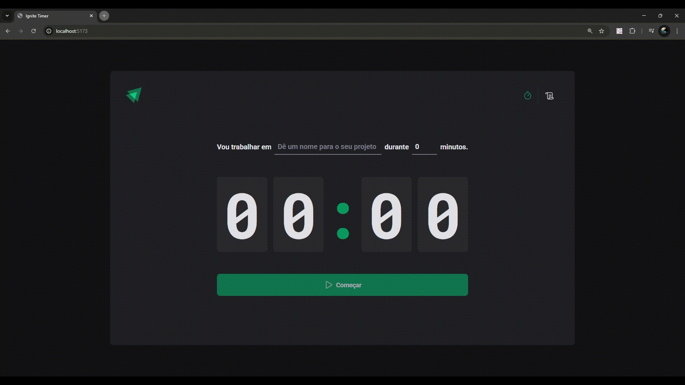

  A timer project, in the Pomodoro Timer style, called Ignite Timer. It was developed during classes on React hooks at Rocketseat.

  <a href="#-conceitos">Concepts</a>&nbsp;&nbsp;&nbsp;|&nbsp;&nbsp;&nbsp;
  <a href="#-tecnologias">Technologies</a>&nbsp;&nbsp;&nbsp;|&nbsp;&nbsp;&nbsp;
  <a href="#-projeto">Project</a>&nbsp;&nbsp;&nbsp;|&nbsp;&nbsp;&nbsp;
  <a href="#memo-licença">License</a>

  

    

## 📖 Concepts

- useEffect
- Contexts API and Props Drilling
- useReducer

## 🚀 Technologies

This project was developed using the following technologies:

- React
- TypeScript
- JavaScript
- Styled Components
- HTML
- CSS

